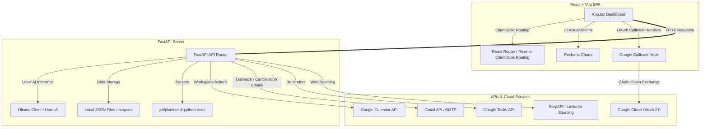
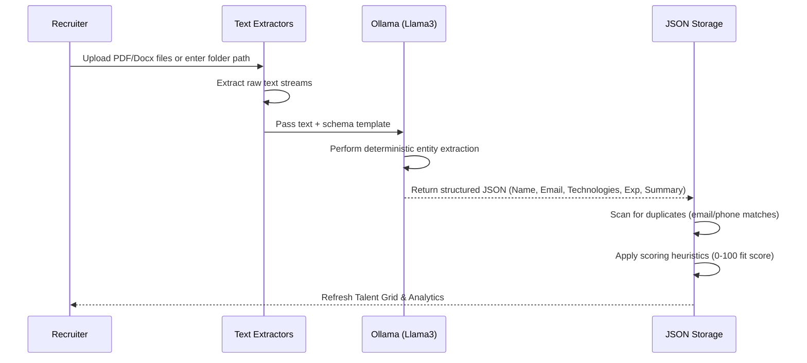

# HRIQ Talent Copilot — System Process & Technical Architecture

HRIQ Talent Copilot is an enterprise-grade, privacy-first AI recruitment platform designed to automate resume parsing, search candidates semantically using local LLMs, source talent from LinkedIn, and handle interviews with direct Google Workspace integrations.

---

## 🛠️ Tech Stack & Integrations

HRIQ utilizes a split-architecture pattern with a FastAPI backend coordinating local AI inference and cloud workspace APIs, paired with a React + Vite frontend.

### 1. Frontend Subsystem
* **Core**: [React 19](https://react.dev/) + [Vite](https://vite.dev/) build environment.
* **Styling**: Vanilla CSS + Tailwind CSS utilities for responsive grid systems and glassmorphic dashboards.
* **Componentry & Icons**: [Lucide React](https://lucide.dev/) for crisp, scalable vector UI indicators.
* **Analytics Rendering**: [Recharts](https://recharts.org/) (PieCharts, BarCharts, Tooltips) to dynamically parse and display candidate experience distribution and industry domains.
* **Hosting**: Deployed globally on [Vercel](https://vercel.com/) utilizing SPA rewrite routing to enable clean paths like `/google-callback` without encountering routing errors.

### 2. Backend Subsystem
* **Application Server**: [FastAPI](https://fastapi.tiangolo.com/) + Uvicorn server executing locally on `127.0.0.1:8000`.
* **Local Inference Engine**: [Ollama](https://ollama.com/) running a fine-tuned temperature profile on `llama3` for deterministic structured extraction and semantic ranking.
* **Text Extraction**: `pdfplumber` (for layout-sensitive PDF scanning) and `python-docx` (for Word document text stream retrieval).
* **Database Layer**: High-performance local JSON flat files (`outputs/pipeline.json`, `outputs/talent_data.json`) simulating a document-store database to ensure complete offline privacy.

### 3. API Integrations
* **Google OAuth 2.0**: Three-scope authorization (`calendar.events`, `gmail.send`, `tasks`) for secure authentication.
* **Google Calendar API**: Direct creation and removal of interview events, automated meeting links, and calendar invites.
* **Gmail API & SMTP Server**: Fallback mail channels sending personalized outreach invitations and cancellations.
* **Google Tasks API**: Automated reminder tasks for recruiters on scheduled dates.
* **SerpAPI Sourcing**: Live query index search to identify matching LinkedIn profile summaries.

---

## 🔄 Core Feature Flows

### 1. Resume Intake & Deep Parsing Flow

### 2. Interview Scheduling & Auto-Invitation Flow
When a recruiter schedules an interview in the **Interview Hub**:
1. **Dynamic Draft Compilation**: The frontend replaces dynamic template brackets (`[DATE]`, `[TIME]`, `[PLATFORM]`, `[INTERVIEWER_NAME]`) with actual selected inputs instantly.
2. **Calendar Booking**: The backend POSTs to `/calendar/v3/calendars/primary/events` with parameter `sendUpdates=all`.
3. **Candidate Association**: The candidate's email address is added to the event's `attendees` field. This directs Google Calendar to automatically email a calendar invite directly to the candidate ("attender").
4. **Task Reminder**: A new action item is pushed to the recruiter's Google Tasks.
5. **Outreach Dispatch**: An invite email copy is pushed through Gmail API or fallback SMTP to ensure the candidate has full written details.

### 3. One-Click Cancellation & Notification Flow
When a recruiter clicks **Cancel** (via Kanban card or table records):
1. **Match Retrieval**: The backend retrieves the matching interview from `pipeline.json` using the candidate's name and role.
2. **Google Event Deletion**: If a `google_event_id` is present, it issues a `DELETE` request to Google Calendar API with `params={"sendUpdates": "all"}`. Google Calendar immediately removes the meeting and sends an automated cancellation email to the candidate.
3. **Gmail cancellation**: A formal cancellation notice email is pushed to the candidate's inbox.
4. **Data Sync**: The interview record is purged from the backend JSON storage, updating all dashboard panels.

---

## 🌟 Key Application Features

| Feature | Description | Tech Implementation |
| :--- | :--- | :--- |
| **Intake Hub** | Batch files drag-and-drop or recursive folder deep scanner. | `FastAPI Multi-Part Files` + `pdfplumber` / `python-docx` |
| **AI Assistant** | Natural language queries to screen, score, and draft outreach candidates. | `Ollama Llama3 JSON schema generation` |
| **Talent Hub** | Matrix grid with dynamic filters, visual domain charts, and Excel exporter. | `Recharts` + `openpyxl` |
| **Web Sourcing** | SerpAPI engine retrieving matching candidates from LinkedIn. | `SerpAPI Google Search engine scraping` |
| **Interview Hub** | Multi-stage Kanban board, Google Calendar schedule, 1-click cancel. | `Google Calendar/Gmail/Tasks APIs` |
| **Diagnostics** | Visual connectivity signals checking API and server uptimes. | `/api/status` endpoint monitor |
